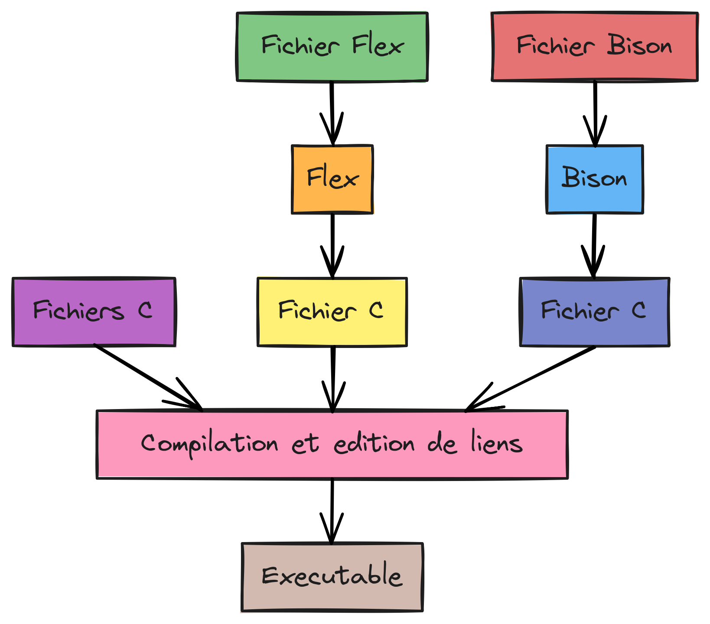
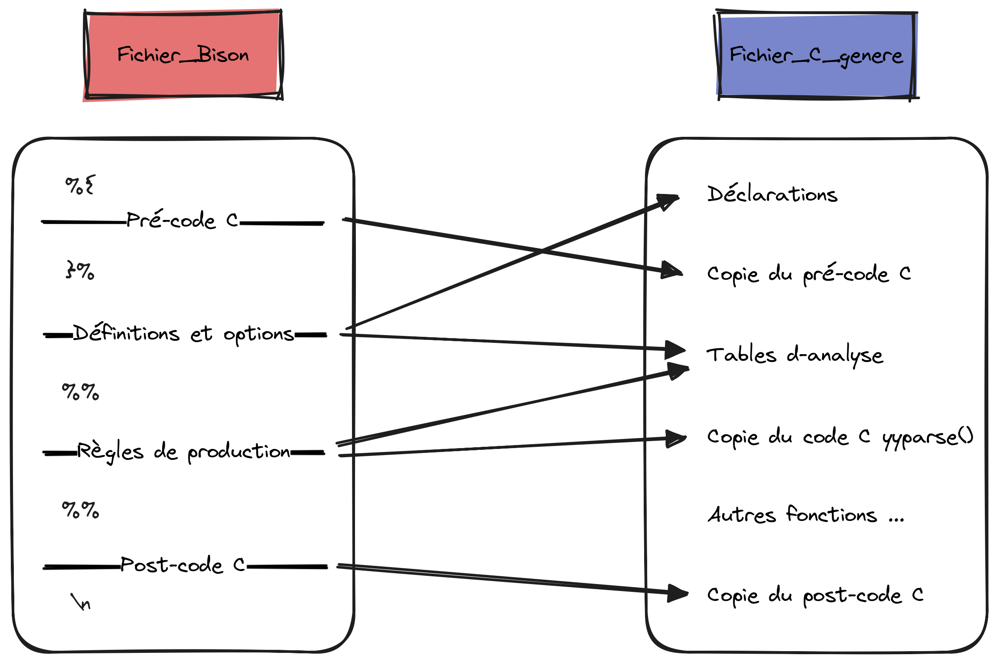

# Documentation Bison

## PREREQUIS

Avoir un minimum de connaissance sur Flex ou Lex.


## DESCRIPTION

Bison est un outil permettant d'écrire des programmes en C qui sont des analyseurs syntaxiques.  
Ce sont des programmes qui vont :
1. reconnaître des mots appartenant à un langage algébrique
2. exécuter une action lorsqu’ils ont reconnu un mot: calcul d'une expression, insertion d'une variable qu'on vient de déclarer dans une table des symboles...

> [!IMPORTANT]
> Les mots qui sont reconnus viennent généralement d'une spécification flex.  
> `#include"lex.yy.c"` est à ajouter dans la partie définitions du fichier.


## STRUCTURE D'UN FICHIER BISON

Le fichier d'entrée de bison est constitué de trois sections, séparées à chaque fois par une ligne composée uniquement de %% :
```
définitions (facultatif)
%%
règles
%%        (omissible si la section suivante est absente)
code utilisateur (facultatif)
\n
```

> [!CAUTION]
> Le programme doit contenir au moins un saut de ligne à la fin.

Les commentaires (`/* Commentaire */`) doivent être indentés pour ne pas être recopiés lors de la compilation.


### **Définitions**

La section de définitions contient les déclarations de bibliothèques et variables C ainsi que les tokens Flex et le nom d'un axiome.  

Les _bibliothèques et variables C_ sont déclarés entre `%{` et `%}`.  

Les tokens Flex et le nom d'un axiome ont la forme :
```
%token nomToken  (uniquement lorsqu'une spécification flex est utilisée)
%start nomAxiome (facultatif)
```

Le _nomToken_ fait référence à un token renvoyé par notre spécification flex.  
On peut écrire plusieurs token sur la même ligne en les séparents par un espace.

Le _nomAxiome_ correspond à un axiome non terminal de la grammaire.  
C'est l'axiome de départ de notre grammaire.


### **Règles**

La section de règles contient la grammaire de notre analyseur formée d'une ou plusieurs règles de la forme:
```
axiome : forme {action}
```

L' _axiome_ est un axiome non terminal de notre grammaire.

La _forme_ est une combinaison de tokens et/ou axiomes, ou un élément vide.  
On peut donner plusieurs formes reconnus en les séparants par un `|` ainsi :
```
axiome : forme1 {action1}
       | forme2 {action2}
;
```

L'_action_ peut être n'importe quelle instruction C arbitraire.
Si l'action est vide, alors quand la grammaire est reconnu, on ne fait rien.  

Si `%start nomAxiome` n'a pas été mentionné dans la section précédente, c'est le premier axiome écrit qui est par défault utilisé comme axiome de départ.


### **Code utilisateur**

La section de code utilisateur contient du code C qui est copié tel quel lors de la compilation.

Code par défaut:
```
void main(){
	yyparse();
}
```


## ANALYSE DE L'ENTRÉE

Quand l'analyseur généré est lancé, il donne son entrée a l'analyseur flex et récupére les tokens renvoyés. Ensuite, il analyse ces tokens en recherchant des formes qui correspondent aux règles de grammaire.

- Si aucune correspondance n'est trouvée, il renvoie un _syntax error_.


## COMPILATION ET EXÉCUTION

Une fois notre fichier .y ou .yacc crée et rempli, on peut le compiler puis l'exécuter.



### **Compilation**

Les commandes de compilation peuvent être regroupés dans un fichier _Makefile_, cela simplifie la démarche.  
Il suffira d'appeler la commande `make` pour que la compilation se fasse toute seule.

1. Compilation du fichier flex (s'il y en a un)

```
flex nom_fichier.lex
```
Cela crée un fichier _lex.yy.c_ que vous avez inclu dans la partie définition du fichier Bison.  
Pour plus de précisions se référer à _DOCFLEX.md_.

2. Compilation du fichier bison

```
bison nom_fichier.yacc
```
Cela crée un fichier _nom\_fichier.tab.c_ qui est un programme C.  
La fonction essentielle de ce programme est _yyparse()_, c’est la fonction qui reconnait les mots de la
grammaire, elle fait appel a _yylex()_.



3. Compilation du fichier C obtenu

```
cc nom_fichier.tab.c -lfl -ly -o nom_executable.exe
```
On obtient un exécutable nommé _nom_executable.exe_.  
_-ly_ indique au compilateur de lier avec la bibliothèque libfl, qui est la bibliothèque de support pour les analyseurs Bison.  
_-lfl_ est à mentionner seulement si l'on a une spécification Flex.  
_-o nom_executable.exe_ si cette partie est omise, l'executable sera par défaut nommé _a.out_.

> [!CAUTION]
> L'ordre -lfl puis -ly est très important.


### **Exécution**

```
./nom_executable.exe
```
Par défaut, l'exécutable lit les données de l’entrée standard (_stdin_) et affiche la sortie vers la sortie standard (_stdout_).  
Cela signifie qu’il attendra que l’utilisateur tape quelque chose sur le clavier et affichera la sortie dans le terminal.

On peut cependant rediriger l'entrée ou la sortie standard.  
Derrière la commande d'execution on ajoute `< fichier_entrée` ou `> fichier_sortie` pour respectivement rediriger l'entrée vers _fichier_entrée_ ou la sortie vers _fichier_sortie_.


## NOTIONS NON COUVERTES

- Installation de Bison
- Écrire une focntion yylex() soit même
- Notion de grammaires


Pour plus de détails: [delafond.org/flex](http://www.delafond.org/traducmanfr/man/man1/flex.1.html)