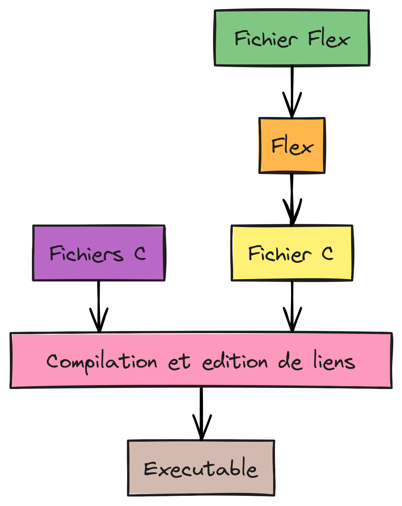
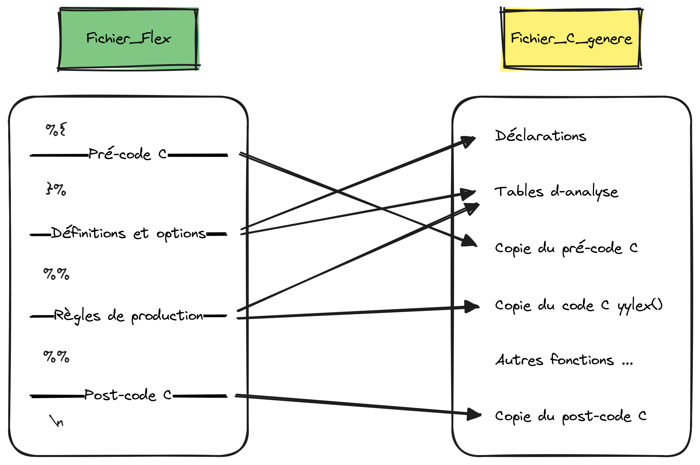

# Documentation Flex


## DESCRIPTION

Flex est un outil permettant d'écrire des programmes en C qui sont des analyseurs lexicaux.  
Ce sont des programmes qui vont :
1. prendre en entrée une suite de caractères (lus dans un fichier, ou directement tapés au clavier)
2. reconnaître dans cette suite de caractères les mots appartenant à un (ou des) langage(s) reconnaissables (chaque langage est défini par une expression rationnelle)
3. exécuter une action lorsqu’ils ont reconnu un mot: traduction, affichage...


## STRUCTURE D'UN FICHIER FLEX

Le fichier d'entrée de flex est constitué de trois sections, séparées à chaque fois par une ligne composée uniquement de %% :
```
définitions (facultatif)
%%
règles
%%        (omissible si la section suivante est absente)
code utilisateur (facultatif)

```

> [!CAUTION]
> Le programme doit contenir au moins un saut de ligne à la fin.

Les commentaires (`/* Commentaire */`) doivent être indentés pour ne pas être recopiés lors de la compilation.


### **Définitions**

La section de définitions contient les déclarations de bibliothèques et variables C ainsi que les définitions Flex qui servent à simplifier la spécification de l'analyseur.  

Les _bibliothèques et variables C_ sont déclarés entre `%{` et `%}`.  

Les définitions Flex ont la forme :
```
nom définition
```

Le _nom_ est un mot commençant par une lettre ou underscore suivi de lettres, chiffres, underscores ou tirets.  
La _définition_ est un regex.  
Les définitions de noms peuvent être référencées plus tard en utilisant : `{nom}`

### **Règles**

La section de règles contient une série de règles de la forme :
```
motif action
```

Le _motif_ est un regex ou une référence sur une définitions de noms.

L'_action_ peut être n'importe quelle instruction C arbitraire.  
Si l'action est vide, alors quand le motif est reconnu, l'élément lexical d'entrée est simplement écarté.  
Une action consistant uniquement en une barre verticale signifie «la même chose que l'action pour la règle suivante.».  
Pour écrire une action sur plusieurs lignes il faut l'entourer de `%{` et `%}`.

Motif spécial:  
`<<EOF>>` un end-of-file (fin de fichier), appel par défaut `yyterminate();` qui termine l'analyseur et retourne 0 indiquant que l'opération est terminée.  
Si une autre action lui est attribué, il faut indiquer `yyterminate();` à la fin.

Actions spéciales:  
`ECHO` comportement identique au cas où aucune correspondance n'est trouvée, le motif reconnu est recopié tel quel sur la sortie standard.

### **Code utilisateur**

La section de code utilisateur contient du code C qui est copié tel quel lors de la compilation.

Code par défaut:
```
void main(){
	yylex();
}
```


## ANALYSE DE L'ENTRÉE

Quand l'analyseur généré est lancé, il analyse son entrée en recherchant des chaînes de caractères qui correspondent à l'un de ses motifs.  
S'il trouve plus d'une correspondance, il utilise celle correspondant au plus de texte.  
S'il trouve deux correspondances ou plus de la même longueur, la règle listée en premier dans le fichier d'entrée de flex est choisie.  
Si aucune correspondance n'est trouvée, alors la règle par défaut est exécutée : le caractère est considéré comme reconnu et est copié sur la sortie standard.

_warning, rule cannot be matched_ indique que la règle donnée n'a pas pu être reconnue car elle suit d'autres règles qui reconnaissent déjà le même texte. Attention à l'ordre des règles.


## COMPILATION ET EXÉCUTION

Une fois notre fichier .l ou .lex crée et rempli, on peut le compiler puis l'exécuter.



### **Compilation**

Les commandes de compilation peuvent être regroupés dans un fichier _Makefile_, cela simplifie la démarche.  
Il suffira d'appeler la commande `make` pour que la compilation se fasse toute seule.

1. Compilation du fichier flex

```
flex nom_fichier.lex
```
Cela crée un fichier _lex.yy.c_ qui est un programme C.  
La fonction essentielle de ce programme est _yylex()_, c’est la fonction qui contient l'automate.



2. Compilation du fichier C obtenu

```
cc lex.yy.c -lfl -o nom_executable.exe
```
On obtient un exécutable nommé _nom_executable.exe_.  
_-lfl_ indique au compilateur de lier avec la bibliothèque libfl, qui est la bibliothèque de support pour les analyseurs Flex.  
_-o nom_executable.exe_ si cette partie est omise, l'executable sera par défaut nommé _a.out_.

### **Exécution**

```
./nom_executable.exe
```
Par défaut, l'exécutable lit les données de l’entrée standard (_stdin_) et affiche la sortie vers la sortie standard (_stdout_).  
Cela signifie qu’il attendra que l’utilisateur tape quelque chose sur le clavier et affichera la sortie dans le terminal.

On peut cependant rediriger l'entrée ou la sortie standard.  
Derrière la commande d'execution on ajoute `< fichier_entrée` ou `> fichier_sortie` pour respectivement rediriger l'entrée vers _fichier_entrée_ ou la sortie vers _fichier_sortie_.


## NOTIONS NON COUVERTES

- Installation de Flex
- Conditions de démarrage Flex
- Règles d'écriture des regex


Pour plus de détails: [delafond.org/flex](http://www.delafond.org/traducmanfr/man/man1/flex.1.html)